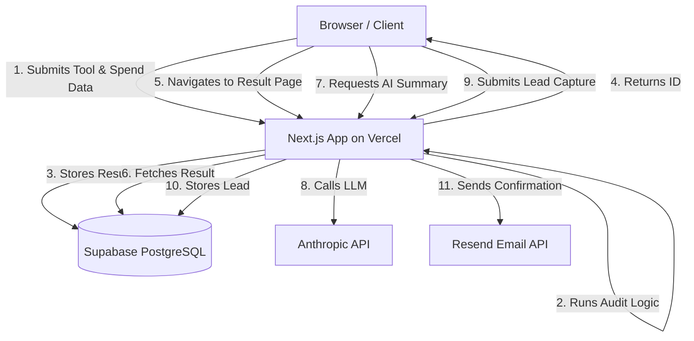

# Architecture

## System Diagram

## Data Flow

1. **Input**: A user visits the landing page and navigates to the audit form. They enter their team size, primary use case, and a list of AI tools they currently pay for.
2. **Audit Engine**: The Next.js frontend sends this data to the `/api/audit` route. The pure-logic audit engine runs 4 checks on each tool (Plan Fit, Downgrade, Alternative, Credex Discount) by comparing it against hardcoded pricing data.
3. **Storage**: The complete audit payload (inputs + generated recommendations and savings) is stored in a Supabase `audits` table. A unique UUID is generated.
4. **Result View**: The user is redirected to `/audit/[id]`. The page fetches the audit data from Supabase and renders the breakdown.
5. **AI Summary**: The client asynchronously requests an LLM-generated summary from `/api/summary` to avoid blocking the page load.
6. **Lead Capture**: If the user provides an email, the lead is stored in the `leads` table and a transactional email is triggered via Resend.

## Stack Justification

* **Frontend**: Next.js 14 App Router. Selected for React Server Components (fast initial load) and Server-Side Rendering (critical for dynamic Open Graph tags so shared audit links look good on Twitter/Slack).
* **Styling**: Tailwind CSS + shadcn/ui. Provides a premium, customizable dark-mode aesthetic without the bloat of traditional component libraries.
* **Database**: Supabase (PostgreSQL). Chosen over Document DBs because relational querying will be vital later for aggregate analytics (e.g., "What is the average spend of a 50-person startup?").
* **LLM**: Anthropic Claude 3 Haiku. Chosen for its balance of high speed and strong summarization capabilities.

## Scaling to 10k Audits/Day

If this tool had to handle 10,000 audits per day, I would change the following:
1. **Edge Caching**: Cache the `pricing-data.ts` and standard recommendations at the edge using Cloudflare or Vercel Edge Middleware.
2. **Asynchronous Processing**: Move the Anthropic API call to a background worker (e.g., using Inngest or Upstash) to prevent API timeouts during traffic spikes.
3. **Connection Pooling**: Implement PgBouncer or Supabase's connection pooling to handle the high volume of concurrent database inserts.
4. **Rate Limiting**: Implement strict Redis-based rate limiting on the lead capture and LLM endpoints to prevent abuse and API exhaustion.
